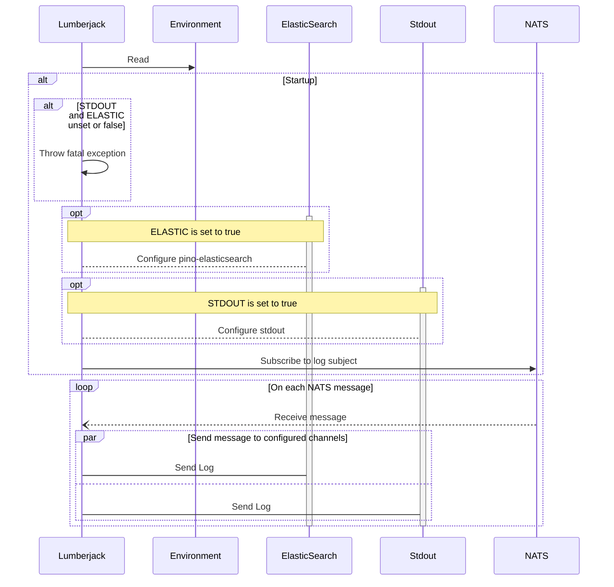

<!-- SPDX-License-Identifier: Apache-2.0 -->

# logger-service

This application subscribes to a [NATS] subject where the messages it receives are logs. The logs' destination is up to the user.

## Sequence Diagram

