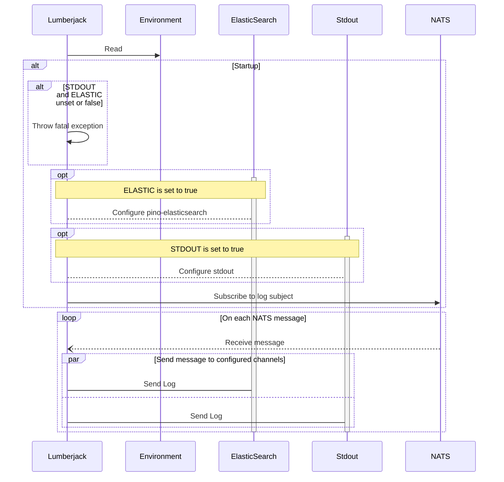

<!-- SPDX-License-Identifier: Apache-2.0 -->

# logger-service

This application subscribes to a [NATS] subject where the messages it receives are logs. The logs' destination is up to the user.

## Sequence Diagram

## Environment

| Name                     | Example                | Purpose                                         |
|--------------------------|------------------------|-------------------------------------------------|
| `NATS_SERVER`            | `nats://localhost:4222` | Specifies the NATS server address.              |
| `NATS_SUBJECT`           | `Lumberjack`           | Defines the NATS subject for message subscription. |
| `ELASTIC_SEARCH_VERSION` | `8`                 | The version of Elastic Search in your deployment |
| `ELASTIC_HOST`           | `http://localhost:9200`| Specifies the Elasticsearch server address.    |
| `ELASTIC_USERNAME`       | `elastic`              | Provides the username for Elasticsearch authentication. |
| `ELASTIC_PASSWORD`       | `password123`          | Provides the password for Elasticsearch authentication. |
| `ELASTIC_INDEX`          | `logs-tazama`          | Sets the Elasticsearch index to use for storing logs. |
| `FLUSHBYTES`             | `1024`                 | Defines the number of bytes to flush before writing to the log. |
| `STDOUT`                 | `true`                 | Determines whether to output logs to standard output. |
| `ELASTIC`                | `true`                 | Indicates whether to use Elasticsearch for logging. |

> [!TIP]
> A sample [.env](.env.example) file has been provided. Adapt it to your use case.

## Dependencies

- **NATS**: (**Required**)
- **Elasticsearch**: Required if `ELASTIC=true`. This includes:
  - `ELASTIC_HOST`
  - `ELASTIC_USERNAME`
  - `ELASTIC_PASSWORD`
  - `ELASTIC_INDEX`

## FAQ and Troubleshooting

For FAQ and troubleshooting, consult: [Troubleshooting](https://github.com/tazama-lf/docs/blob/f3f5cf07425e9785c27531511601fc61a81e51e4/Technical/Logging/Troubleshooting.md)
